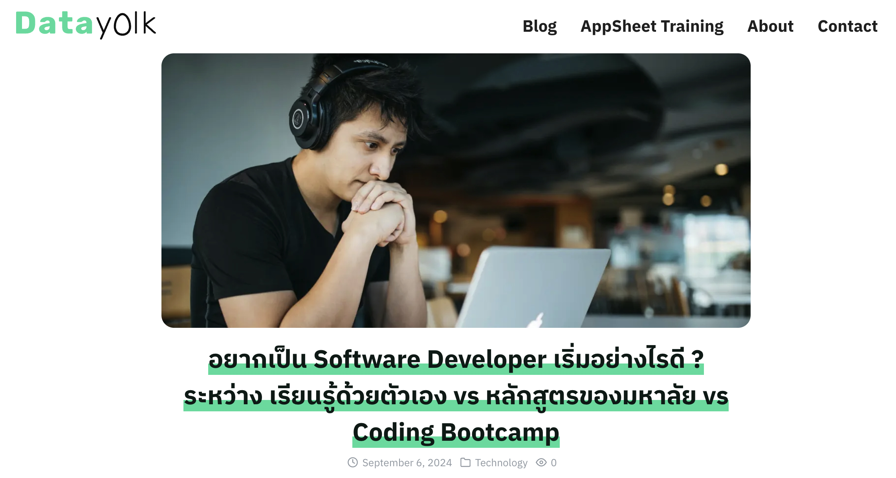

# Back-end Developer
คือผู้เชี่ยวชาญด้านการพัฒนาส่วนหลังของเว็บไซต์และแอปพลิเคชัน ซึ่งเกี่ยวข้องกับการจัดการฐานข้อมูล, การเขียนโค้ดฝั่งเซิร์ฟเวอร์, และการบูรณาการกับ API (Application Programming Interface) โดยทำงานร่วมกับ Front-end Developer เพื่อให้ระบบทั้งหมดทำงานอย่างราบรื่นและมีประสิทธิภาพ

## หน้าที่ของ Back-end Developer

1. **พัฒนาและดูแลฝั่งเซิร์ฟเวอร์**: เขียนโค้ดและพัฒนาแอปพลิเคชันฝั่งเซิร์ฟเวอร์ โดยใช้ภาษาโปรแกรม เช่น Node.js, Python, Java, Ruby, PHP, และอื่นๆ
2. **จัดการฐานข้อมูล**: ออกแบบและจัดการฐานข้อมูลทั้งเชิงสัมพันธ์ (Relational Database) และฐานข้อมูลแบบ NoSQL เพื่อเก็บและเข้าถึงข้อมูล
3. **พัฒนา API**: สร้างและบูรณาการ API เพื่อให้ Front-end และแอปพลิเคชันอื่นๆ สามารถติดต่อและรับส่งข้อมูลได้
4. **ความปลอดภัยของระบบ**: ป้องกันการโจมตีและความเสี่ยงด้านความปลอดภัยโดยการใช้เทคนิคและเครื่องมือต่างๆ เช่น การเข้ารหัส, การตรวจสอบสิทธิ์ และการจัดการเซสชัน
5. **ประสิทธิภาพและการขยายระบบ**: ปรับปรุงและเพิ่มประสิทธิภาพการทำงานของแอปพลิเคชัน และออกแบบระบบให้สามารถขยายได้เมื่อมีผู้ใช้เพิ่มขึ้น
6. **การทดสอบและ Debugging**: ทดสอบการทำงานของโค้ดและแก้ไขข้อบกพร่องที่พบเพื่อให้แอปพลิเคชันทำงานได้อย่างถูกต้องและมีประสิทธิภาพ
7. **ทำงานร่วมกับทีม Front-end**: ประสานงานกับ Front-end Developer เพื่อให้การเชื่อมต่อระหว่างฝั่งเซิร์ฟเวอร์และฝั่งผู้ใช้ทำงานอย่างราบรื่น

## ความสามารถที่ต้องมี

1. **ทักษะการเขียนโปรแกรม**: มีความรู้และทักษะในการใช้ภาษาโปรแกรมที่ใช้ในฝั่งเซิร์ฟเวอร์ เช่น Node.js, Python, Java, Ruby, PHP, และอื่นๆ
2. **การจัดการฐานข้อมูล**: มีความรู้เกี่ยวกับฐานข้อมูลเชิงสัมพันธ์ (เช่น MySQL, PostgreSQL) และ NoSQL (เช่น MongoDB, Cassandra)
3. **การพัฒนา API**: ความสามารถในการสร้างและบูรณาการ RESTful API หรือ GraphQL
4. **ความรู้ด้านความปลอดภัย**: เข้าใจและสามารถใช้เทคนิคการป้องกันความปลอดภัยของข้อมูลและแอปพลิเคชัน
5. **การจัดการเซิร์ฟเวอร์และโครงสร้างพื้นฐาน**: ความรู้เกี่ยวกับการตั้งค่าและจัดการเซิร์ฟเวอร์, การใช้ Docker, Kubernetes, และบริการคลาวด์ เช่น AWS, Google Cloud Platform, Azure
6. **ทักษะการแก้ปัญหา**: มีทักษะในการวิเคราะห์และแก้ไขข้อบกพร่องของโค้ดได้อย่างรวดเร็วและมีประสิทธิภาพ
7. **การทำงานร่วมกับทีม**: สามารถสื่อสารและทำงานร่วมกับทีมพัฒนาอื่นๆ ได้ดี

## การเตรียมตัวและเส้นทางการเติบโต

1. **การศึกษา**:
    - ปริญญาตรีในสาขาวิทยาการคอมพิวเตอร์, วิศวกรรมคอมพิวเตอร์ หรือสาขาที่เกี่ยวข้อง
    - การเรียนรู้ด้วยตัวเองหรือการเข้าคอร์สออนไลน์ที่เน้นการพัฒนาเว็บฝั่งเซิร์ฟเวอร์

2. **การฝึกงานและประสบการณ์การทำงาน**:
    - หาประสบการณ์การทำงานหรือฝึกงานในสายงานพัฒนาเว็บ
    - สร้างโปรเจ็กต์ส่วนตัวหรือพอร์ตโฟลิโอเพื่อแสดงความสามารถและผลงานของตนเอง

3. **การเรียนรู้ตลอดชีวิต**:
    - ติดตามการเปลี่ยนแปลงและแนวโน้มในวงการเทคโนโลยีเว็บ
    - เข้าร่วมชุมชนออนไลน์, ฟอรัม, และการประชุมหรือสัมมนาด้านเทคโนโลยีเว็บ

## การพัฒนาทักษะเพิ่มเติม

1. **เรียนรู้เฟรมเวิร์กและไลบรารีใหม่ๆ**: เช่น Express.js, Django, Spring Boot เพื่อเพิ่มประสิทธิภาพในการพัฒนาและขยายขอบเขตความสามารถของตนเอง
2. **เรียนรู้เกี่ยวกับการพัฒนา Microservices**: เพื่อเตรียมความพร้อมสำหรับการพัฒนาแอปพลิเคชันที่มีการแบ่งส่วนและขยายตัวได้ง่าย
3. **การเรียนรู้เพิ่มเติมเกี่ยวกับ DevOps**: การเรียนรู้เครื่องมือและเทคนิคที่ใช้ในการปรับปรุงกระบวนการพัฒนาและการส่งมอบซอฟต์แวร์ เช่น Jenkins, GitLab CI/CD
4. **พัฒนาทักษะการออกแบบระบบ**: การเรียนรู้การออกแบบระบบและสถาปัตยกรรมซอฟต์แวร์ เช่น Domain-Driven Design (DDD), Event-Driven Architecture (EDA)

## คำแนะนำเพิ่มเติม

1. **สร้างเครือข่าย**: เข้าร่วมกลุ่มและชุมชนของนักพัฒนาเว็บ เพื่อแลกเปลี่ยนประสบการณ์และความรู้
2. **ทำโปรเจ็กต์ส่วนตัว**: สร้างและพัฒนาโปรเจ็กต์ส่วนตัว เพื่อฝึกฝนทักษะและสร้างพอร์ตโฟลิโอ
3. **เรียนรู้จากแหล่งข้อมูลออนไลน์**: ใช้ประโยชน์จากคอร์สออนไลน์, บทความ, วิดีโอ และหนังสือ เพื่อพัฒนาความรู้และทักษะของตนเอง
   
## อยากเป็น Software Developer เริ่มอย่างไรดี ? ระหว่าง เรียนรู้ด้วยตัวเอง vs หลักสูตรของมหาลัย vs Coding Bootcamp
> ขอบคุณเนื้อหาดีๆจาก **[Datayolk](https://datayolk.net/)**

 บทความนี้จะมาเปรียบเทียบ 3 วิธีหลักในการเริ่มต้นเส้นทางการเป็น Software Developer ของทุกคน (ผู้เขียนสรุปมาดีงามมากๆครับอยากชวนศึกษากัน)
- เรียนรู้ด้วยตัวเอง (Self-taught) ผ่าน คอร์สออนไลน์แบบฟรี (3 เดือน – 1 ปี)
- เรียนหลักสูตรของมหาวิทยาลัย (2 – 4 ปี)
- เรียน Coding Bootcamp (3 – 4 เดือน)

[อยากเป็น Software Developer เริ่มอย่างไรดี ? ระหว่าง เรียนรู้ด้วยตัวเอง vs หลักสูตรของมหาลัย vs Coding Bootcamp](https://datayolk.net/technology/learning-to-code-self-taught-vs-bootcamp-vs-cs-degree/)
